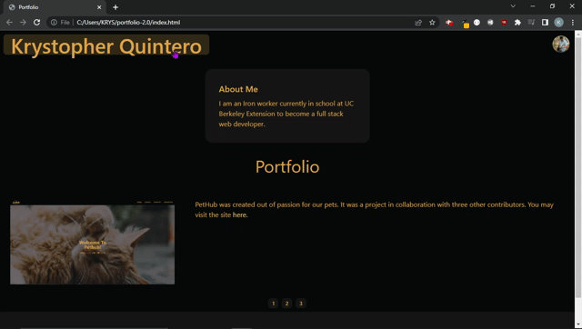

# portfolio-2.0

## **ABOUT**
Welcome to my *PORTFOLIO* within you'll find many resources about me and my past/present projects.
 You can visit the deplyed link [here.](https://krystopherq.github.io/portfolio-2.0/)

## **Navigation Bar**
Selectin my name at the top will open a new tab to my GitHub. At the top right corner of the site there is a profile picture. Select it and a drop down menu will appear with the options for Resume, Portfolio, and Contact. Select one and you will be directed to a new tab with the selected information.
